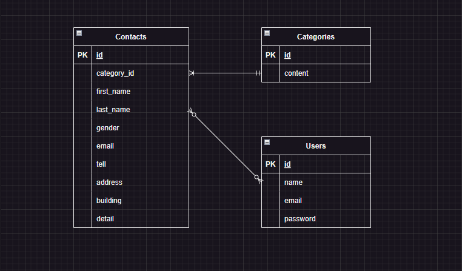

# アプリケーション名
お問い合わせフォーム

## 環境構築
### Dockerビルド 
  1．個人でディレクトリ・ファイル・ヴァージョン情報を記述 
  2．docker-compose up-d --build 

### Laravel環境構築 
  1.docker-compose exec php bash 
  2.composer create-project "laravel/laravel=8.*" . --prefer-dist 
  3.php artisan migrate 
  4.php artisan db:seed

## 使用技術(実行環境)
  ・php:7.4.9-fpm 
  ・mysql:8.0.26 
  ・nginx:1.21.1

## ER図

## URL
  ・開発環境：http://localhost/ 
  ・phpMyAdmin：http://localhost:8080/
